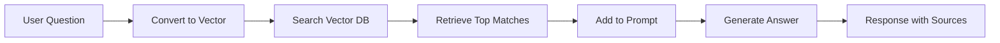

# 🤖 RAG from Scratch

[](https://opensource.org/licenses/MIT)
[](https://www.python.org/downloads/)
[](https://ollama.com)

> **Build a Retrieval-Augmented Generation (RAG) system from the ground up — no frameworks, just pure Python and math!**

An educational implementation that demonstrates how RAG systems work under the hood. Perfect for developers learning about AI, vector embeddings, and semantic search.

---

## ✨ What Makes This Special?

- 🎓 **Educational Focus**: Learn RAG concepts by building from scratch
- 🔍 **No Black Boxes**: Every component is implemented explicitly
- 🚀 **Runs Locally**: No API keys, no cloud services required
- 📊 **Visual Feedback**: See similarity scores and retrieved context
- 💡 **Production Concepts**: Understand what libraries like LangChain do behind the scenes

---

## 🎯 What is RAG?

**Retrieval-Augmented Generation** solves a critical AI problem: LLMs don't know everything!



**Traditional LLM:**
- ❌ Limited to training data
- ❌ Can't access private/recent information
- ❌ Prone to hallucinations

**RAG System:**
- ✅ Retrieves relevant facts first
- ✅ Grounds responses in real data
- ✅ Transparent about sources

---

## 🏗️ Architecture

This implementation includes three core components:

### 1️⃣ Vector Database (In-Memory)
```python
VECTOR_DB = [(chunk, embedding), ...]
```
- Stores text chunks with their embeddings
- Simple Python list (no external DB needed)
- Perfect for learning the fundamentals

### 2️⃣ Embedding Model
**Model:** `bge-base-en-v1.5-gguf` (68MB)
- Converts text → 768-dimensional vectors
- Enables semantic similarity search
- Runs locally via Ollama

### 3️⃣ Language Model
**Model:** `Llama-3.2-1B-Instruct` (807MB)
- Generates natural language responses
- Uses retrieved context for accuracy
- Fast inference on CPU

---

## 🚀 Quick Start

### Prerequisites

**Install Ollama:**
```bash
# macOS
brew install ollama

# Linux
curl -fsSL https://ollama.com/install.sh | sh

# Windows
# Download from https://ollama.com
```

### Installation

**Clone and run:**
```bash
git clone https://github.com/Dhanush1205/rag-from-scratch.git
cd rag-from-scratch
bash start_rag.sh
```

That's it! The script will:
1. ✅ Start Ollama server
2. ✅ Download required models (~875MB total)
3. ✅ Index the knowledge base
4. ✅ Launch interactive Q&A

---

## 💬 Usage Example

```
================================================================================
RAG System - Retrieval-Augmented Generation Demo
================================================================================

Loading dataset...
✓ Loaded 20 entries from cat-facts.txt

Indexing dataset (creating embeddings)...
✓ Indexing complete! Vector database contains 20 chunks.

================================================================================
You can now ask questions about cats!
Type 'quit' or 'exit' to stop.
================================================================================

Ask me a question: How fast can cats run?

Retrieving relevant knowledge...

Retrieved knowledge:
  - (similarity: 0.82) Cats can run at speeds of up to 31 mph (49 km) over short distances.
  - (similarity: 0.58) Cats can jump up to six times their length.
  - (similarity: 0.51) A cat's heart beats nearly twice as fast as a human heart...

Generating response...
Chatbot response:
--------------------------------------------------------------------------------
According to the provided context, cats can reach speeds of approximately 31 mph
(49 km/h) when running over short distances. This makes them quite fast animals,
especially considering their size!
--------------------------------------------------------------------------------
```

---

## 🔬 How It Works

### Phase 1: Indexing (One-time setup)

```python
for chunk in dataset:
    embedding = embed_model(chunk)  # Convert to vector
    VECTOR_DB.append((chunk, embedding))  # Store
```

**What happens:**
- Load cat-facts.txt (20 facts)
- Generate 768-dim embedding for each fact
- Store in memory as tuples

### Phase 2: Retrieval (Per query)

```python
def retrieve(query, top_n=3):
    query_vec = embed_model(query)
    
    similarities = []
    for chunk, chunk_vec in VECTOR_DB:
        score = cosine_similarity(query_vec, chunk_vec)
        similarities.append((chunk, score))
    
    return sorted(similarities, reverse=True)[:top_n]
```

**What happens:**
1. Convert user question to vector
2. Calculate similarity with all stored chunks
3. Return top 3 most relevant facts

### Phase 3: Generation

```python
context = "\n".join(retrieved_chunks)
prompt = f"Use this context: {context}\n\nQuestion: {query}"
response = language_model(prompt)
```

**What happens:**
- Add retrieved facts to the prompt
- Ask LLM to answer using only that context
- Stream response back to user

---

## 📊 Cosine Similarity Math

The heart of retrieval is **cosine similarity**:

```python
def cosine_similarity(a, b):
    dot_product = sum(x * y for x, y in zip(a, b))
    norm_a = sum(x ** 2 for x in a) ** 0.5
    norm_b = sum(x ** 2 for x in b) ** 0.5
    return dot_product / (norm_a * norm_b)
```

**Formula:**
```
similarity = (A · B) / (||A|| × ||B||)
```

**Returns:** Number between -1 and 1
- `1.0` = Identical meaning
- `0.0` = Unrelated
- `-1.0` = Opposite meaning

---

## 📁 Project Structure

```
rag-from-scratch/
├── 📄 rag_demo.py          # Main implementation (150 lines)
├── 📄 cat-facts.txt        # Knowledge base (20 facts)
├── 📄 start_rag.sh         # Automated setup script
├── 📄 README.md            # You are here!
├── 📄 LICENSE              # MIT License
└── 📄 .gitignore           # Git ignore rules
```

---

## 🎓 What You'll Learn

- ✅ **Vector Embeddings**: How text becomes numbers
- ✅ **Semantic Search**: Finding meaning, not just keywords
- ✅ **Cosine Similarity**: Mathematical similarity measurement
- ✅ **Prompt Engineering**: How context improves LLM accuracy
- ✅ **Streaming Responses**: Real-time token generation
- ✅ **Local LLMs**: Running AI without cloud services

---

## 🛠️ Customization

### Use Your Own Dataset

Replace `cat-facts.txt` with your own data:

```python
# rag_demo.py, line 36
with open('your-dataset.txt', 'r') as file:
    dataset = file.readlines()
```

**Format:** One fact per line

### Adjust Retrieval

Change how many facts to retrieve:

```python
# rag_demo.py, line 99
retrieved_knowledge = retrieve(input_query, top_n=5)  # Default: 3
```

### Use Different Models

Swap embedding or language models:

```python
# rag_demo.py, lines 3-4
EMBEDDING_MODEL = 'your-embedding-model'
LANGUAGE_MODEL = 'your-language-model'
```

**Popular alternatives:**
- Language: `llama3.2:3b`, `gemma2:9b`, `qwen2.5:7b`
- Embedding: `nomic-embed-text`, `mxbai-embed-large`

---

## 🚧 Limitations & Improvements

### Current Limitations

| Issue | Impact |
|-------|--------|
| Line-by-line chunking | Poor for complex documents |
| In-memory storage | Not scalable to millions of chunks |
| No reranking | May miss best results |
| Single query | Can't handle multi-faceted questions |
| Small model (1B) | Limited reasoning ability |

### Suggested Improvements

**🎯 Easy Wins:**
- Add overlap between chunks
- Implement max chunk size (e.g., 500 tokens)
- Support multiple file formats (PDF, DOCX)

**🔥 Advanced:**
- Integrate vector DB (ChromaDB, Qdrant)
- Add reranking model (cross-encoder)
- Implement multi-query retrieval
- Add conversation memory
- Use larger models (7B, 13B)

---

## 🤝 Contributing

Contributions welcome! Here are some ideas:

- 📝 Add support for PDF documents
- 🧮 Implement different similarity metrics (Euclidean, dot product)
- 🔍 Add a reranking layer
- 💾 Integrate a vector database
- 🎨 Build a web interface
- 📊 Add evaluation metrics

**Process:**
1. Fork the repository
2. Create a feature branch (`git checkout -b feature/amazing-idea`)
3. Commit your changes (`git commit -m 'Add amazing idea'`)
4. Push to branch (`git push origin feature/amazing-idea`)
5. Open a Pull Request

---

## 📚 Learning Resources

### RAG Fundamentals
- [RAG Paper](https://arxiv.org/abs/2005.11401) - Lewis et al., 2020
- [HuggingFace Tutorial](https://huggingface.co/blog/ngxson/rag-from-scratch) - Original inspiration
- [Pinecone RAG Guide](https://www.pinecone.io/learn/retrieval-augmented-generation/)

### Vector Embeddings
- [Sentence Embeddings Guide](https://www.sbert.net/)
- [Understanding Vector Databases](https://www.pinecone.io/learn/vector-database/)

### Ollama Documentation
- [Ollama Docs](https://github.com/ollama/ollama)
- [Ollama Python Library](https://github.com/ollama/ollama-python)

---

## 📜 License

This project is licensed under the **MIT License** - see the [LICENSE](LICENSE) file for details.

---

## 🙏 Acknowledgments

- **Xuan-Son Nguyen** for the [original tutorial](https://huggingface.co/blog/ngxson/rag-from-scratch)
- **Ollama** team for making local LLMs accessible
- **Meta AI** for Llama models
- **BGE Team** for embedding models

---

## ⭐ Star This Repo

If this helped you learn about RAG systems, give it a star! ⭐

It helps others discover the project and motivates continued development.

---

## 📬 Questions or Issues?

- 🐛 Found a bug? [Open an issue](https://github.com/Dhanush1205/rag-from-scratch/issues)
- 💡 Have an idea? [Start a discussion](https://github.com/Dhanush1205/rag-from-scratch/discussions)
- 📧 Want to chat? Reach out on GitHub!

---

<div align="center">

**Built with ❤️ for learning**

Made by [Dhanush1205](https://github.com/Dhanush1205)

</div>
